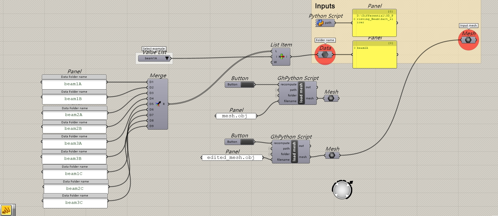
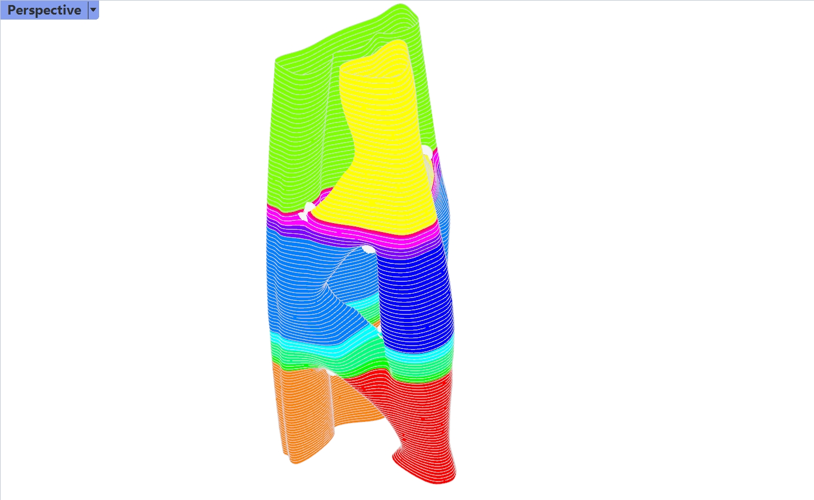
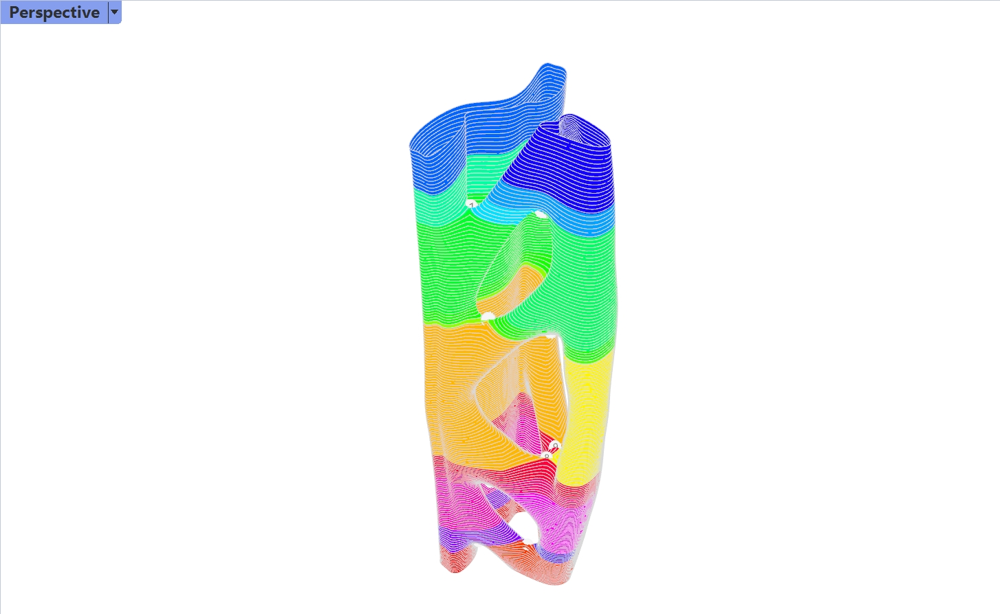
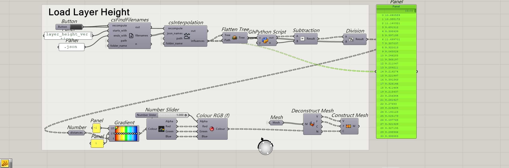

# NP-3DP

This project is based on
[DART-Research/NP-3DP](https://github.com/DART-Research/NP-3DP),
providing **3D printing slicing and path generation** with Python.\
By modifying input files and parameters, you can perform slicing and
curved slicing experiments for different models.

------------------------------------------------------------------------

## 📂 Project Structure

Download all Python files from the repository into the same directory,
for example:

    NP-3DP/
    │── ex2_curved_slicing.py
    │── curved_slicing_master.gh
    │── ...
    │── beam1A/                 # Example input folder (must be created manually)
    │     └── mesh.obj       # OBJ file to be sliced

You can create multiple input folders (e.g., `beam1B`, `beam1C`) and place
your `.obj` file inside, but the file name must be:

    mesh.obj

------------------------------------------------------------------------

## ⚙️ Environment Setup

Set up the environment using conda:

``` bash
conda config --add channels conda-forge
conda create -n np_env compas_slicer==0.6.1 compas==1.17.4
conda activate np_env

conda install -c conda-forge compas_cgal
python -m compas_rhino.install -v 7.0
conda activate np_env

pip install scipy==1.10.0
python -m compas_slicer

conda install -c conda-forge compas_libigl
pip install gudhi 
pip install pymsgbox
```

------------------------------------------------------------------------

## ▶️ Usage

1.  **Prepare the model file**\
    Create a new folder (e.g., `beam1A`) in the project root and place your
    OBJ file inside, named as:

        ex1/mesh.obj

2.  **Modify parameters**\
    Open `curved_slicing.py` (path may be in `ex2/curved_slicing.py`)
    and update the following parameters:

    ``` python
    input_folder_name = 'beam1A'   # Must match the folder name
    avg_layer_height = 10       # Set layer height
    ```

3.  **Run the script**

    ``` bash
    ex2_curved_slicing.py
    ```

------------------------------------------------------------------------

## 🔧 Notes

-   Make sure `Rhino 7.0` is installed (required by `compas_rhino`).\
-   The OBJ file must be a triangular mesh and must be named exactly
    `mesh.obj`.\
-   For testing different models, create separate folders (e.g., `beam1B`,
    `beam1C`) and update `input_folder_name` accordingly.

------------------------------------------------------------------------

## 👀 Visualization

For visualization, use the `curved_slicing_master.gh` file:

1.  Open `curved_slicing_master.gh`.\
2.  Make sure the `folder_name` inside matches the one you set earlier
    in `curved_slicing.py` (e.g., `beam1A`).\
\
*Folder name setting in Grasshopper*
3.  After running, you can use the **Rhino interface** to view the slicing result.\
\
\
*Editing in Rhino/Grasshopper*
4.  At the same time, you can use **Grasshopper** to view all
    `layer_height` data.

    \
*Layer height data visualization in Grasshopper*


